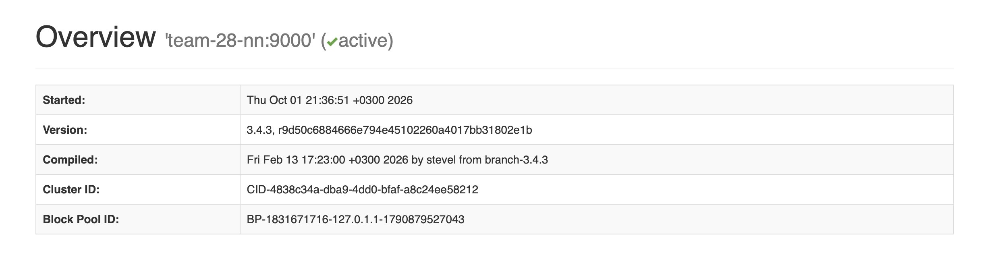

# HDFS cluster deployment — team28a

Репозиторий содержит пошаговую инструкцию ручного развертывания HDFS-кластера для команды `team28a`, в которую входят: Насертдинов Малик и Соколова Елизавета.

В результате был развернут кластер, включающий:

- 1 NameNode;
- 1 SecondaryNameNode;
- 3 DataNode.

Также была выполнена проверка работоспособности кластера через:

- HDFS CLI;
- `hdfs fsck`;
- логи Hadoop;
- Web UI NameNode.

---

## 1. Инфраструктура

Для команды `team-28` предоставлен общий набор виртуальных машин:

| Узел | Внутренний IP | Назначение |
|---|---|---|
| `team-28-en` | `10.28.0.10` | edge-узел |
| `team-28-nn` | `10.28.0.11` | NameNode + DataNode |
| `team-28-00` | `10.28.0.12` | SecondaryNameNode + DataNode |
| `team-28-01` | `10.28.0.13` | DataNode |

Edge-узел `team-28-en` используется для входа во внутреннюю сеть и подключения к остальным виртуальным машинам. HDFS-сервисы на нем не запускаются.

Итоговая архитектура HDFS:

```text
team-28-nn
├── NameNode
└── DataNode #1

team-28-00
├── SecondaryNameNode
└── DataNode #2

team-28-01
└── DataNode #3
```

## 2. Пользователи и SSH-доступ

Одни и те же виртуальные машины `team-28` используются двумя независимыми командами. Разделение окружений производится с помощью Linux-пользователей:

- `team28a` — наша команда;
- `team28b` — другая команда.

Вся дальнейшая настройка нашего HDFS-кластера выполнялась под пользователем `team28a`. Пользователь `team28b` и его окружение в данной инструкции не используются.

Файлы нашей команды размещаются в домашнем каталоге:

```text
/home/team28a
```

### Создание пользователя `team28a`

Для двух участников команды был создан один общий Linux-пользователь `team28a`.

Команда выполнялась с административными правами:

```bash
sudo adduser --disabled-password --gecos "" team28a
```

Пользователь был создан без пароля и без предоставления ему прав `sudo`. Для входа используются SSH-ключи участников команды.

Для хранения разрешённых SSH-ключей были созданы каталог `.ssh` и файл `authorized_keys`:

```bash
sudo mkdir -p /home/team28a/.ssh
sudo touch /home/team28a/.ssh/authorized_keys
```

В файл:

```text
/home/team28a/.ssh/authorized_keys
```

были добавлены публичные SSH-ключи обоих участников команды.

После этого были настроены владелец и права доступа:

```bash
sudo chown -R team28a:team28a /home/team28a/.ssh
sudo chmod 700 /home/team28a/.ssh
sudo chmod 600 /home/team28a/.ssh/authorized_keys
```

Таким образом, оба участника подключаются под общим пользователем `team28a`, но каждый использует собственный закрытый SSH-ключ.

Вход на edge-узел:

```bash
ssh team28a@2.59.83.133
```

### Внутренний SSH-доступ

Для подключения с edge-узла к внутренним виртуальным машинам уже под пользователем `team28a` был создан отдельный SSH-ключ:

```bash
ssh-keygen -t ed25519 -f ~/.ssh/team28a_internal -N ""
```

Его публичная часть была добавлена в `authorized_keys` пользователя `team28a` на узлах:

- `team-28-nn`;
- `team-28-00`;
- `team-28-01`.

После этого для подключения к внутренним узлам использовался ключ:

```text
~/.ssh/team28a_internal
```

## 3. Проверка доступа к узлам и разрешения имён

После настройки SSH был проверен доступ пользователя `team28a` ко всем внутренним виртуальным машинам.

Подключение выполнялось с edge-узла `team-28-en` с использованием внутреннего SSH-ключа:

```bash
ssh -i ~/.ssh/team28a_internal team28a@team-28-nn
```

```bash
ssh -i ~/.ssh/team28a_internal team28a@team-28-00
```

```bash
ssh -i ~/.ssh/team28a_internal team28a@team-28-01
```

Успешное подключение ко всем трем узлам подтвердило, что дальнейшую установку и настройку Hadoop можно выполнять непосредственно под пользователем `team28a`.

### Проверка hostname

На edge-узле было проверено разрешение имен внутренних машин:

```bash
getent hosts team-28-nn team-28-00 team-28-01
```

Основные внутренние адреса узлов:

```text
10.28.0.11  team-28-nn
10.28.0.12  team-28-00
10.28.0.13  team-28-01
```

В дальнейшем для обращения к узлам в конфигурации Hadoop используются их hostname:

```text
team-28-nn
team-28-00
team-28-01
```

При проверке также было обнаружено, что собственный hostname виртуальной машины может дополнительно разрешаться в локальный адрес `127.0.1.1`.

Например, для `team-28-nn` присутствовало разрешение как во внутренний адрес `10.28.0.11`, так и в loopback-адрес `127.0.1.1`.

Эта особенность впоследствии потребовала дополнительной настройки адреса, на котором слушает RPC-интерфейс NameNode. Исправление приведено ниже в разделе запуска и настройки NameNode.

## 4. Установка Java и Hadoop

Пользователь `team28a` не имеет прав `sudo`, поэтому Java и Hadoop устанавливались не системно, а непосредственно в домашний каталог пользователя.

Для установки использовались:

- Temurin OpenJDK 11;
- Apache Hadoop 3.4.3.

На edge-узле `team-28-en` архивы были сохранены в каталог:

```text
/home/team28a/downloads
```

Использованные источники:

```text
Hadoop 3.4.3:
https://dlcdn.apache.org/hadoop/common/hadoop-3.4.3/hadoop-3.4.3.tar.gz

Java 11:
https://api.adoptium.net/v3/binary/latest/11/ga/linux/x64/jdk/hotspot/normal/eclipse
```

Файлы были сохранены как:

```text
~/downloads/hadoop-3.4.3.tar.gz
~/downloads/jdk11.tar.gz
```

### Проверка архивов

Перед копированием и распаковкой целостность архивов была проверена:

```bash
gzip -t ~/downloads/hadoop-3.4.3.tar.gz
```

```bash
gzip -t ~/downloads/jdk11.tar.gz
```

Команды завершились без ошибок.

### Копирование архивов на узлы

Архивы Java и Hadoop были переданы с edge-узла `team-28-en` на все три внутренние виртуальные машины с помощью `scp` и внутреннего SSH-ключа `team28a_internal`.

Копирование выполнялось на:

```text
team-28-nn
team-28-00
team-28-01
```

После копирования архивы находились в каталоге:

```text
/home/team28a/downloads
```

на каждом узле.

### Распаковка

На каждой из трех внутренних машин были созданы каталоги для Java и Hadoop:

```bash
mkdir -p ~/apps/java ~/apps/hadoop
```

Java была распакована в:

```text
/home/team28a/apps/java
```

командой:

```bash
tar -xzf ~/downloads/jdk11.tar.gz \
  --strip-components=1 \
  -C ~/apps/java
```

Hadoop был распакован в:

```text
/home/team28a/apps/hadoop
```

командой:

```bash
tar -xzf ~/downloads/hadoop-3.4.3.tar.gz \
  --strip-components=1 \
  -C ~/apps/hadoop
```

Параметр `--strip-components=1` удаляет верхний каталог архива при распаковке, поэтому используются постоянные пути `~/apps/java` и `~/apps/hadoop`.

### Проверка версий

После установки была проверена версия Java:

```bash
~/apps/java/bin/java -version
```

Установленная версия:

```text
openjdk version "11.0.32.1"
Temurin 11.0.32.1+1
```

Версия Hadoop:

```bash
~/apps/hadoop/bin/hadoop version
```

Результат:

```text
Hadoop 3.4.3
```

Одинаковые версии Java и Hadoop были установлены на всех трех внутренних узлах. Это важно было проверить для распределённого кластера.

## 5. Настройка переменных окружения

После установки Java и Hadoop переменные окружения были настроены на всех трех внутренних узлах:

- `team-28-nn`;
- `team-28-00`;
- `team-28-01`.

В файл:

```text
~/.bashrc
```

были добавлены следующие строки:

```bash
export JAVA_HOME=$HOME/apps/java
export HADOOP_HOME=$HOME/apps/hadoop
export PATH=$JAVA_HOME/bin:$HADOOP_HOME/bin:$HADOOP_HOME/sbin:$PATH
```

Для пользователя `team28a` переменные соответствуют следующим каталогам:

```text
JAVA_HOME=/home/team28a/apps/java
HADOOP_HOME=/home/team28a/apps/hadoop
```

`JAVA_HOME` указывает расположение установленной Java 11.

`HADOOP_HOME` указывает корневой каталог Hadoop.

Добавление каталогов `bin` и `sbin` Hadoop в `PATH` позволяет использовать команды Hadoop без указания полного пути к исполняемым файлам.

### Настройка Java для Hadoop

На каждом из трех узлов также был изменен файл:

```text
~/apps/hadoop/etc/hadoop/hadoop-env.sh
```

В нем был указан путь к установленной Java:

```bash
export JAVA_HOME=$HOME/apps/java
```

Таким образом, все узлы используют Java из:

```text
/home/team28a/apps/java
```

и Hadoop из:

```text
/home/team28a/apps/hadoop
```

## 6. Настройка `core-site.xml`

На всех трех внутренних узлах был настроен основной конфигурационный файл Hadoop:

```text
~/apps/hadoop/etc/hadoop/core-site.xml
```

На `team-28-nn`, `team-28-00` и `team-28-01` использовалась одинаковая конфигурация:

```xml
<?xml version="1.0"?>
<?xml-stylesheet type="text/xsl" href="configuration.xsl"?>

<configuration>
    <property>
        <name>fs.defaultFS</name>
        <value>hdfs://team-28-nn:9000</value>
    </property>
</configuration>
```

Параметр `fs.defaultFS` задает адрес файловой системы HDFS и NameNode, к которому должны обращаться Hadoop-клиенты:

```text
hdfs://team-28-nn:9000
```

Здесь:

- `hdfs://` — используется файловая система HDFS;
- `team-28-nn` — hostname узла, на котором запускается NameNode;
- `9000` — RPC-порт NameNode.

Hostname `team-28-nn` используется вместо IP-адреса, так как на предыдущем этапе было проверено корректное разрешение имен внутренних узлов.

Эта конфигурация была одинаково размещена на всех трех машинах, чтобы каждый узел обращался к одному и тому же NameNode.

## 7. Настройка `hdfs-site.xml`

На всех трех внутренних узлах был настроен файл:

```text
~/apps/hadoop/etc/hadoop/hdfs-site.xml
```

Изначально использовалась следующая базовая конфигурация:

```xml
<?xml version="1.0"?>
<?xml-stylesheet type="text/xsl" href="configuration.xsl"?>

<configuration>
    <property>
        <name>dfs.replication</name>
        <value>3</value>
    </property>

    <property>
        <name>dfs.namenode.name.dir</name>
        <value>file:///home/team28a/hdfs/namenode</value>
    </property>

    <property>
        <name>dfs.datanode.data.dir</name>
        <value>file:///home/team28a/hdfs/datanode</value>
    </property>

    <property>
        <name>dfs.namenode.checkpoint.dir</name>
        <value>file:///home/team28a/hdfs/namesecondary</value>
    </property>

    <property>
        <name>dfs.namenode.secondary.http-address</name>
        <value>team-28-00:9868</value>
    </property>
</configuration>
```

### Репликация

Параметр:

```text
dfs.replication = 3
```

задает количество копий каждого блока HDFS.

В нашем кластере используются три DataNode, поэтому каждый блок может храниться в трех репликах:

```text
team-28-nn  → DataNode #1
team-28-00  → DataNode #2
team-28-01  → DataNode #3
```

### Каталог NameNode

NameNode хранит свои служебные данные в:

```text
/home/team28a/hdfs/namenode
```

Путь задается параметром:

```text
dfs.namenode.name.dir
```

### Каталог DataNode

Данные каждого DataNode хранятся в:

```text
/home/team28a/hdfs/datanode
```

Путь задается параметром:

```text
dfs.datanode.data.dir
```

Одинаковый путь используется на всех трех виртуальных машинах, но на каждой машине это отдельный локальный каталог.

### Каталог SecondaryNameNode

Для checkpoint-данных SecondaryNameNode используется:

```text
/home/team28a/hdfs/namesecondary
```

Путь задается параметром:

```text
dfs.namenode.checkpoint.dir
```

SecondaryNameNode был размещен на узле:

```text
team-28-00
```

Его HTTP-адрес был задан параметром:

```text
dfs.namenode.secondary.http-address
```

со значением:

```text
team-28-00:9868
```

Таким образом, базовая конфигурация HDFS задает три реплики данных, локальные каталоги для NameNode, DataNode и SecondaryNameNode, а также размещение SecondaryNameNode на `team-28-00`.

## 8. Создание каталогов HDFS

После настройки `hdfs-site.xml` на каждом узле были созданы локальные каталоги, используемые соответствующими HDFS-сервисами.

### `team-28-nn`

На узле `team-28-nn` впоследствии запускаются NameNode и DataNode, поэтому были созданы два каталога:

```bash
mkdir -p ~/hdfs/namenode ~/hdfs/datanode
```

Получившиеся пути:

```text
/home/team28a/hdfs/namenode
/home/team28a/hdfs/datanode
```

### `team-28-00`

На узле `team-28-00` запускаются SecondaryNameNode и DataNode:

```bash
mkdir -p ~/hdfs/namesecondary ~/hdfs/datanode
```

Получившиеся пути:

```text
/home/team28a/hdfs/namesecondary
/home/team28a/hdfs/datanode
```

### `team-28-01`

На узле `team-28-01` запускается DataNode:

```bash
mkdir -p ~/hdfs/datanode
```

Получившийся путь:

```text
/home/team28a/hdfs/datanode
```

В результате локальные каталоги соответствуют ролям узлов и путям, ранее указанным в `hdfs-site.xml`:

```text
team-28-nn
├── hdfs/namenode
└── hdfs/datanode

team-28-00
├── hdfs/namesecondary
└── hdfs/datanode

team-28-01
└── hdfs/datanode
```

## 9. Первичная инициализация NameNode

После создания локальных каталогов был инициализирован NameNode.

Команда выполнялась на узле:

```text
team-28-nn
```

под пользователем `team28a`.

Форматирование NameNode:

```bash
JAVA_HOME=$HOME/apps/java \
~/apps/hadoop/bin/hdfs namenode -format
```

Команда инициализирует metadata HDFS в каталоге, указанном ранее в `hdfs-site.xml`:

```text
/home/team28a/hdfs/namenode
```

Форматирование завершилось успешно. Hadoop создал служебные данные NameNode и идентификатор block pool.

В нашем случае был создан:

```text
BP-1831671716-127.0.1.1-1790879527043
```

Важно: `hdfs namenode -format` выполнялся только один раз — перед первым запуском HDFS-кластера.

После появления рабочего namespace NameNode повторное форматирование не выполнялось. Для дальнейших остановок и запусков сервиса использовались команды управления daemon-процессом, а не повторный `format`.

## 10. Первый запуск NameNode и настройка RPC-доступа

После однократного форматирования NameNode был впервые запущен на узле:

```text
team-28-nn
```

Команда запуска:

```bash
JAVA_HOME=$HOME/apps/java \
~/apps/hadoop/bin/hdfs --daemon start namenode
```

После запуска процесс NameNode успешно появился в списке Java-процессов.

Однако при проверке сетевых портов было обнаружено, что RPC-интерфейс NameNode слушает только локальный адрес:

```text
127.0.1.1:9000
```

При этом Web UI NameNode был доступен на:

```text
0.0.0.0:9870
```

RPC-порт `9000` должен быть доступен другим узлам HDFS-кластера, поэтому привязка к loopback-адресу `127.0.1.1` не подходила.

Ранее при проверке hostname было обнаружено, что собственное имя виртуальной машины может разрешаться через `127.0.1.1`. Для явной привязки RPC-интерфейса ко всем сетевым интерфейсам конфигурация NameNode была изменена.

Сначала NameNode был остановлен:

```bash
JAVA_HOME=$HOME/apps/java \
~/apps/hadoop/bin/hdfs --daemon stop namenode
```

На узле `team-28-nn` в файл:

```text
~/apps/hadoop/etc/hadoop/hdfs-site.xml
```

был добавлен параметр:

```xml
<property>
    <name>dfs.namenode.rpc-bind-host</name>
    <value>0.0.0.0</value>
</property>
```

Значение `0.0.0.0` используется как bind-address и означает, что NameNode принимает RPC-соединения на всех сетевых интерфейсах машины.

При этом адрес HDFS для клиентов не изменился и по-прежнему задается в `core-site.xml`:

```text
hdfs://team-28-nn:9000
```

После изменения конфигурации NameNode был снова запущен:

```bash
JAVA_HOME=$HOME/apps/java \
~/apps/hadoop/bin/hdfs --daemon start namenode
```

После перезапуска NameNode слушал:

```text
0.0.0.0:9000
0.0.0.0:9870
```

где:

```text
9000 — RPC NameNode
9870 — Web UI NameNode
```

После этого доступность RPC-порта `team-28-nn:9000` была проверена с узлов `team-28-00` и `team-28-01`.

На обоих узлах проверка завершилась результатом:

```text
NAMENODE_REACHABLE
```

Таким образом, NameNode стал доступен всем внутренним узлам кластера через `team-28-nn:9000`.

## 11. Запуск первого DataNode и настройка hostname

Первый DataNode был запущен на том же узле, где работает NameNode:

```text
team-28-nn
```

Команда запуска:

```bash
JAVA_HOME=$HOME/apps/java \
~/apps/hadoop/bin/hdfs --daemon start datanode
```

После запуска на `team-28-nn` одновременно работали два HDFS-сервиса:

```text
NameNode
DataNode
```

При первоначальной проверке первый DataNode отображался с локальным адресом:

```text
127.0.0.1:9866
```

Так как кластер состоит из нескольких виртуальных машин, для обмена между узлами было настроено использование hostname DataNode.

На всех трех узлах в `hdfs-site.xml` были добавлены параметры:

```xml
<property>
    <name>dfs.client.use.datanode.hostname</name>
    <value>true</value>
</property>

<property>
    <name>dfs.datanode.use.datanode.hostname</name>
    <value>true</value>
</property>
```

Также на каждом узле был явно указан его hostname.

На `team-28-nn`:

```xml
<property>
    <name>dfs.datanode.hostname</name>
    <value>team-28-nn</value>
</property>
```

На `team-28-00`:

```xml
<property>
    <name>dfs.datanode.hostname</name>
    <value>team-28-00</value>
</property>
```

На `team-28-01`:

```xml
<property>
    <name>dfs.datanode.hostname</name>
    <value>team-28-01</value>
</property>
```

После изменения конфигурации DataNode на `team-28-nn` был перезапущен:

```bash
JAVA_HOME=$HOME/apps/java \
~/apps/hadoop/bin/hdfs --daemon stop datanode
```

```bash
JAVA_HOME=$HOME/apps/java \
~/apps/hadoop/bin/hdfs --daemon start datanode
```

В информации о DataNode hostname стал определяться как:

```text
team-28-nn
```

При этом в одном из полей отчета адрес первого DataNode продолжал отображаться как `127.0.0.1:9866`.

Поэтому доступность DataNode была дополнительно проверена с другого узла кластера — `team-28-00`:

```bash
timeout 3 bash -c "</dev/tcp/team-28-nn/9866" \
&& echo DATANODE_REACHABLE \
|| echo DATANODE_NOT_REACHABLE
```

Результат:

```text
DATANODE_REACHABLE
```

Таким образом, DataNode на `team-28-nn` был реально доступен другим машинам кластера через hostname `team-28-nn` и transfer-порт `9866`.

## 12. Запуск второго и третьего DataNode

После настройки первого DataNode были последовательно запущены DataNode на двух оставшихся внутренних узлах.

### DataNode на `team-28-00`

На узле `team-28-00` был запущен второй DataNode:

```bash
JAVA_HOME=$HOME/apps/java \
~/apps/hadoop/bin/hdfs --daemon start datanode
```

Наличие процесса было проверено с помощью:

```bash
jps
```

После запуска состояние HDFS было проверено командой:

```bash
JAVA_HOME=$HOME/apps/java \
~/apps/hadoop/bin/hdfs dfsadmin -report
```

NameNode отображал:

```text
Live datanodes (2)
```

DataNode на `team-28-00` зарегистрировался с адресом:

```text
10.28.0.12:9866
```

и hostname:

```text
team-28-00
```

### DataNode на `team-28-01`

На третьем узле был запущен еще один DataNode:

```bash
JAVA_HOME=$HOME/apps/java \
~/apps/hadoop/bin/hdfs --daemon start datanode
```

После запуска наличие процесса также было проверено через:

```bash
jps
```

Повторная проверка состояния кластера:

```bash
JAVA_HOME=$HOME/apps/java \
~/apps/hadoop/bin/hdfs dfsadmin -report
```

показала:

```text
Live datanodes (3)
```

Таким образом, NameNode видел все три DataNode:

```text
team-28-nn
team-28-00
team-28-01
```

В отчете узлы отображались следующим образом:

```text
10.28.0.12:9866   hostname: team-28-00
10.28.0.13:9866   hostname: team-28-01
127.0.0.1:9866    hostname: team-28-nn
```

Для первого DataNode поле адреса продолжало отображаться через loopback, однако его доступность по `team-28-nn:9866` ранее была успешно проверена с другого узла.

Позже корректная работа этого DataNode была дополнительно подтверждена фактической репликацией HDFS на все три узла.

## 13. Запуск SecondaryNameNode

SecondaryNameNode был запущен на узле:

```text
team-28-00
```

На этой машине уже работал DataNode, поэтому итоговое распределение сервисов на узле стало следующим:

```text
team-28-00
├── DataNode
└── SecondaryNameNode
```

SecondaryNameNode был запущен командой:

```bash
JAVA_HOME=$HOME/apps/java \
~/apps/hadoop/bin/hdfs --daemon start secondarynamenode
```

После запуска наличие процесса было проверено:

```bash
jps
```

На `team-28-00` присутствовали:

```text
DataNode
SecondaryNameNode
```

### Проверка HTTP-порта

В `hdfs-site.xml` ранее был задан адрес SecondaryNameNode:

```xml
<property>
    <name>dfs.namenode.secondary.http-address</name>
    <value>team-28-00:9868</value>
</property>
```

После запуска порт был проверен командой:

```bash
ss -ltn | grep :9868
```

Фактически сервис слушал:

```text
127.0.1.1:9868
```

Дополнительная перенастройка HTTP-интерфейса SecondaryNameNode не выполнялась, так как для проверки задания Web UI SecondaryNameNode не требовался, а сам процесс работал корректно.

Работа механизма checkpoint позже также подтверждалась актуальным значением `Last Checkpoint Time` в Web UI NameNode.

Checkpoint-данные SecondaryNameNode хранятся в каталоге:

```text
/home/team28a/hdfs/namesecondary
```

SecondaryNameNode используется для создания checkpoint metadata HDFS и не является резервным NameNode.

## 14. Функциональная проверка HDFS

После запуска всех необходимых HDFS-сервисов была выполнена практическая проверка записи и чтения данных.

Проверка выполнялась с узла:

```text
team-28-nn
```

### Создание тестового файла

Сначала в локальной файловой системе Linux был создан тестовый файл:

```bash
echo "Hello HDFS from team28a" > ~/hdfs-test.txt
```

Локальный путь файла:

```text
/home/team28a/hdfs-test.txt
```

На этом этапе файл еще не находился в HDFS.

### Создание каталога в HDFS

В HDFS был создан отдельный каталог нашей команды:

```bash
hdfs dfs -mkdir -p /team28a
```

Путь:

```text
/team28a
```

относится уже к HDFS namespace, а не к локальной файловой системе Linux.

### Загрузка файла

Локальный тестовый файл был загружен в HDFS:

```bash
hdfs dfs -put -f ~/hdfs-test.txt /team28a/
```

После этого содержимое каталога было проверено:

```bash
hdfs dfs -ls /team28a
```

В HDFS появился файл:

```text
/team28a/hdfs-test.txt
```

В выводе присутствовала строка вида:

```text
-rw-r--r--   3 team28a supergroup 24 ... /team28a/hdfs-test.txt
```

Число `3` указывает replication factor файла.

### Проверка чтения

Содержимое загруженного файла было прочитано непосредственно из HDFS:

```bash
hdfs dfs -cat /team28a/hdfs-test.txt
```

Результат:

```text
Hello HDFS from team28a
```

Таким образом, кластер успешно выполнил полный цикл записи и чтения данных через HDFS.

## 15. Проверка целостности и репликации через `fsck`

После успешной записи и чтения тестового файла была выполнена проверка его состояния в HDFS.

Команда:

```bash
hdfs fsck /team28a/hdfs-test.txt -files -blocks -locations
```

Проверялся файл:

```text
/team28a/hdfs-test.txt
```

В результате HDFS сообщил:

```text
/team28a/hdfs-test.txt 24 bytes, replicated: replication=3, 1 block(s): OK
```

Для блока было зафиксировано:

```text
Live_repl=3
```

То есть HDFS видел три живые реплики блока.

Реплики находились на трех DataNode:

```text
10.28.0.12:9866
10.28.0.13:9866
127.0.0.1:9866
```

Первый DataNode продолжал отображаться в данном поле через loopback-адрес, однако наличие трех живых реплик подтверждает, что все три DataNode реально участвовали в хранении данных.

Итоговая проверка показала:

```text
Status: HEALTHY
Number of data-nodes: 3
Under-replicated blocks: 0
Default replication factor: 3
Average block replication: 3.0
Missing blocks: 0
Corrupt blocks: 0
Missing replicas: 0
```

Таким образом:

- кластер содержит три DataNode;
- replication factor равен `3`;
- все три реплики блока доступны;
- отсутствуют потерянные, поврежденные и недореплицированные блоки;
- проверяемый путь HDFS имеет статус `HEALTHY`.

## 16. Финальная проверка процессов

После запуска всех сервисов была выполнена проверка Java-процессов на каждом узле.

На `team-28-nn`:

```bash
jps
```

Результат:

```text
NameNode
DataNode
```

На `team-28-00`:

```bash
jps
```

Результат:

```text
DataNode
SecondaryNameNode
```

На `team-28-01`:

```bash
jps
```

Результат:

```text
DataNode
```

Итоговое распределение сервисов:

```text
team-28-nn
├── NameNode
└── DataNode

team-28-00
├── SecondaryNameNode
└── DataNode

team-28-01
└── DataNode
```

Таким образом, в кластере работают:

- 1 NameNode;
- 1 SecondaryNameNode;
- 3 DataNode.

## 17. Проверка логов Hadoop

В качестве дополнительной проверки состояния кластера были просмотрены логи Hadoop на всех трех внутренних узлах.

Логи располагаются в каталоге:

```text
~/apps/hadoop/logs/
```

Для поиска критических сообщений использовалась команда:

```bash
grep -RniE "FATAL|ERROR" \
~/apps/hadoop/logs/*.log \
2>/dev/null | tail -n 20 || true
```

На узлах:

```text
team-28-00
team-28-01
```

команда не вывела сообщений уровней `ERROR` или `FATAL`.

На `team-28-nn` были найдены только сообщения:

```text
RECEIVED SIGNAL 15: SIGTERM
```

Эти записи соответствуют штатным остановкам и перезапускам NameNode и DataNode, выполненным во время настройки кластера.

Например, сервисы останавливались командами:

```bash
hdfs --daemon stop namenode
```

```bash
hdfs --daemon stop datanode
```

Критических ошибок в логах работающего кластера обнаружено не было.

## 18. Проверка кластера через NameNode Web UI

Для финальной проверки состояния кластера был открыт Web UI NameNode.

NameNode работает на узле:

```text
team-28-nn
```

и использует Web UI на порту:

```text
9870
```

Так как `team-28-nn` находится во внутренней сети, доступ к Web UI с локального компьютера был организован через SSH-туннель через edge-узел:

```bash
ssh -N -L 9870:team-28-nn:9870 team28a@2.59.83.133
```

После создания туннеля интерфейс NameNode был открыт в браузере:

```text
http://localhost:9870
```

### Активный NameNode

В интерфейсе отображался активный NameNode:

```text
team-28-nn:9000 (active)
```



Это подтверждает, что NameNode запущен на `team-28-nn` и работает с RPC-адресом `team-28-nn:9000`.

### Состояние DataNode

В разделе Summary интерфейса NameNode были получены следующие показатели:

```text
Live Nodes: 3
Dead Nodes: 0
Total Datanode Volume Failures: 0
Number of Under-Replicated Blocks: 0
```


Таким образом:

- все три DataNode находятся в состоянии `Live`;
- отсутствуют `Dead Nodes`;
- отсутствуют ошибки томов DataNode;
- отсутствуют недореплицированные блоки.

В интерфейсе также отображалось актуальное значение `Last Checkpoint Time`, что дополнительно подтверждает работу механизма checkpoint после запуска SecondaryNameNode.

По результатам проверки через Web UI кластер находится в работоспособном состоянии и соответствует требованию задания о наличии трех работающих DataNode без деградировавших узлов.

## 19. Итог

В результате ручного развертывания был получен работоспособный HDFS-кластер следующей архитектуры:

```text
team-28-nn
├── NameNode
└── DataNode #1

team-28-00
├── SecondaryNameNode
└── DataNode #2

team-28-01
└── DataNode #3
```

В кластере работают:

- 1 NameNode;
- 1 SecondaryNameNode;
- 3 DataNode.

Для HDFS был установлен replication factor:

```text
3
```

Работоспособность кластера была подтверждена несколькими проверками.

### Состояние DataNode

Команда:

```bash
hdfs dfsadmin -report
```

показала:

```text
Live datanodes (3)
```

### Проверка записи и чтения

Тестовый файл был успешно загружен в HDFS и прочитан обратно:

```text
/team28a/hdfs-test.txt
```

Содержимое:

```text
Hello HDFS from team28a
```

### Проверка целостности

Команда:

```bash
hdfs fsck /team28a/hdfs-test.txt -files -blocks -locations
```

показала:

```text
Status: HEALTHY
Live_repl=3
Number of data-nodes: 3
Under-replicated blocks: 0
Missing blocks: 0
Corrupt blocks: 0
Missing replicas: 0
```

### Проверка логов

На узлах `team-28-00` и `team-28-01` сообщений уровней `ERROR` и `FATAL` обнаружено не было.

На `team-28-nn` присутствовали только записи `SIGTERM`, соответствующие штатным остановкам и перезапускам сервисов во время настройки.

Критических ошибок работающего кластера обнаружено не было.

### Проверка через NameNode Web UI

В Web UI NameNode были зафиксированы следующие показатели:

```text
Live Nodes: 3
Dead Nodes: 0
Total Datanode Volume Failures: 0
Number of Under-Replicated Blocks: 0
```

Таким образом, все три DataNode находятся в рабочем состоянии, потерянные или недореплицированные блоки отсутствуют, а HDFS-кластер имеет статус `HEALTHY`.

Развертывание выполнялось вручную под пользователем `team28a`. Автоматизированные скрипты в рамках данной работы не использовались.
