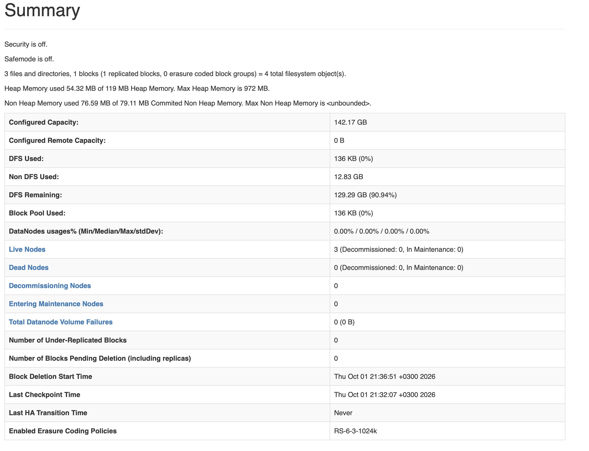

# Домашнее задание №1

Репозиторий содержит пошаговую инструкцию ручного развертывания HDFS-кластера для команды `team28a`.

В результате был развернут кластер, включающий:

- 1 NameNode;
- 1 SecondaryNameNode;
- 3 DataNode.

Также была выполнена проверка работоспособности кластера через:

- HDFS CLI;
- `hdfs fsck`;
- логи Hadoop;
- Web UI NameNode.


## Содержание

1. [Инфраструктура](#1-инфраструктура)
2. [Пользователи и SSH-доступ](#2-пользователи-и-ssh-доступ)
3. [Проверка доступа к узлам и разрешения имён](#3-проверка-доступа-к-узлам-и-разрешения-имён)
4. [Установка Java и Hadoop](#4-установка-java-и-hadoop)
5. [Настройка переменных окружения](#5-настройка-переменных-окружения)
6. [Настройка core-site.xml](#6-настройка-core-sitexml)
7. [Настройка hdfs-site.xml](#7-настройка-hdfs-sitexml)
8. [Создание каталогов HDFS](#8-создание-каталогов-hdfs)
9. [Первичная инициализация NameNode](#9-первичная-инициализация-namenode)
10. [Запуск NameNode и проверка RPC-доступа](#10-запуск-namenode-и-проверка-rpc-доступа)
11. [Запуск первого DataNode](#11-запуск-первого-datanode)
12. [Запуск второго и третьего DataNode](#12-запуск-второго-и-третьего-datanode)
13. [Запуск SecondaryNameNode](#13-запуск-secondarynamenode)
14. [Функциональная проверка HDFS](#14-функциональная-проверка-hdfs)
15. [Проверка целостности и репликации через fsck](#15-проверка-целостности-и-репликации-через-fsck)
16. [Финальная проверка процессов](#16-финальная-проверка-процессов)
17. [Проверка логов Hadoop](#17-проверка-логов-hadoop)
18. [Проверка кластера через NameNode Web UI](#18-проверка-кластера-через-namenode-web-ui)
19. [Итог](#19-итог)


## 1. Инфраструктура

Для команды `team-28` предоставлен общий набор виртуальных машин:

| Узел | Внутренний IP | Назначение |
|---|---|---|
| `team-28-en` | `10.28.0.10` | edge-узел |
| `team-28-nn` | `10.28.0.11` | NameNode + DataNode |
| `team-28-00` | `10.28.0.12` | SecondaryNameNode + DataNode |
| `team-28-01` | `10.28.0.13` | DataNode |

Edge-узел `team-28-en` используется для входа во внутреннюю сеть и подключения к остальным виртуальным машинам. HDFS-сервисы на нем не запускаются.

Итоговая архитектура HDFS:

```text
team-28-nn
├── NameNode
└── DataNode #1

team-28-00
├── SecondaryNameNode
└── DataNode #2

team-28-01
└── DataNode #3
```
<EDGE_IP> — внешний IP edge-узла, предоставленный преподавателем.

## 2. Пользователи и SSH-доступ

Одни и те же виртуальные машины `team-28` используются двумя независимыми командами. Разделение окружений производится с помощью Linux-пользователей:

- `team28a` — наша команда;
- `team28b` — другая команда.

Вся дальнейшая настройка нашего HDFS-кластера выполнялась под пользователем `team28a`. Пользователь `team28b` и его окружение в данной инструкции не используются.

Файлы нашей команды размещаются в домашнем каталоге:

```text
/home/team28a
```

### Создание пользователя `team28a`

Для двух участников команды был создан один общий Linux-пользователь `team28a`.

Команда выполнялась с административными правами:

```bash
sudo adduser --disabled-password --gecos "" team28a
```

Пользователь был создан без пароля и без предоставления ему прав `sudo`. Для входа используются SSH-ключи участников команды.

Для хранения разрешённых SSH-ключей были созданы каталог `.ssh` и файл `authorized_keys`:

```bash
sudo mkdir -p /home/team28a/.ssh
sudo touch /home/team28a/.ssh/authorized_keys
```

В файл:

```text
/home/team28a/.ssh/authorized_keys
```

были добавлены публичные SSH-ключи обоих участников команды.

После этого были настроены владелец и права доступа:

```bash
sudo chown -R team28a:team28a /home/team28a/.ssh
sudo chmod 700 /home/team28a/.ssh
sudo chmod 600 /home/team28a/.ssh/authorized_keys
```

Таким образом, оба участника подключаются под общим пользователем `team28a`, но каждый использует собственный закрытый SSH-ключ.

Вход на edge-узел:

```bash
ssh team28a@<EDGE_IP>
```

### Внутренний SSH-доступ

Для подключения с edge-узла к внутренним виртуальным машинам уже под пользователем `team28a` был создан отдельный SSH-ключ:

```bash
ssh-keygen -t ed25519 -f ~/.ssh/team28a_internal -N ""
```

Его публичная часть была добавлена в `authorized_keys` пользователя `team28a` на узлах:

- `team-28-nn`;
- `team-28-00`;
- `team-28-01`.

После этого для подключения к внутренним узлам использовался ключ:

```text
~/.ssh/team28a_internal
```

## 3. Проверка доступа к узлам и разрешения имён

После настройки SSH был проверен доступ пользователя `team28a` ко всем внутренним виртуальным машинам.

Все команды этого раздела выполняются с edge-узла `team-28-en`.

### Проверка SSH-доступа

Подключение выполняется с использованием внутреннего SSH-ключа:

```bash
ssh -i ~/.ssh/team28a_internal team28a@team-28-nn
```

```bash
ssh -i ~/.ssh/team28a_internal team28a@team-28-00
```

```bash
ssh -i ~/.ssh/team28a_internal team28a@team-28-01
```

Успешное подключение ко всем трем узлам подтверждает, что дальнейшую установку и настройку Hadoop можно выполнять под пользователем `team28a`.

### Проверка разрешения hostname

Разрешение имён внутренних машин было проверено отдельно на каждом из трех узлов.

На `team-28-nn`:

```bash
ssh -i ~/.ssh/team28a_internal team28a@team-28-nn \
  'getent hosts team-28-nn team-28-00 team-28-01'
```

На `team-28-00`:

```bash
ssh -i ~/.ssh/team28a_internal team28a@team-28-00 \
  'getent hosts team-28-nn team-28-00 team-28-01'
```

На `team-28-01`:

```bash
ssh -i ~/.ssh/team28a_internal team28a@team-28-01 \
  'getent hosts team-28-nn team-28-00 team-28-01'
```

Основные внутренние адреса узлов:

```text
10.28.0.11  team-28-nn
10.28.0.12  team-28-00
10.28.0.13  team-28-01
```

Таким образом, внутренние узлы доступны друг другу по hostname:

```text
team-28-nn
team-28-00
team-28-01
```

При проверке также было обнаружено, что собственный hostname виртуальной машины может дополнительно разрешаться в локальный loopback-адрес `127.0.1.1`.

Например, для `team-28-nn` имя узла могло разрешаться как во внутренний адрес `10.28.0.11`, так и в локальный адрес `127.0.1.1`.

Эта особенность учитывается далее при настройке RPC-интерфейса NameNode.

## 4. Установка Java и Hadoop

Пользователь `team28a` не имеет прав `sudo`, поэтому Java и Hadoop устанавливаются непосредственно в домашний каталог пользователя.

Для кластера используются:

- Temurin OpenJDK 11;
- Apache Hadoop 3.4.3.

Все команды скачивания и копирования архивов выполняются с edge-узла `team-28-en`.

### Скачивание архивов

Создаем каталог для загрузок:

```bash
mkdir -p ~/downloads
cd ~/downloads
```

Скачиваем Apache Hadoop 3.4.3:

```bash
curl -fL --retry 3 \
  -o hadoop-3.4.3.tar.gz \
  https://dlcdn.apache.org/hadoop/common/hadoop-3.4.3/hadoop-3.4.3.tar.gz
```

Скачиваем Temurin OpenJDK 11:

```bash
curl -fL --retry 3 \
  -o jdk11.tar.gz \
  "https://api.adoptium.net/v3/binary/latest/11/ga/linux/x64/jdk/hotspot/normal/eclipse"
```

Проверяем наличие загруженных файлов:

```bash
ls -lh
```

В каталоге должны присутствовать:

```text
hadoop-3.4.3.tar.gz
jdk11.tar.gz
```

### Проверка архивов

Проверяем целостность архива Hadoop:

```bash
gzip -t hadoop-3.4.3.tar.gz && echo "HADOOP_ARCHIVE_OK"
```

Ожидаемый результат:

```text
HADOOP_ARCHIVE_OK
```

Проверяем архив Java:

```bash
gzip -t jdk11.tar.gz && echo "JAVA_ARCHIVE_OK"
```

Ожидаемый результат:

```text
JAVA_ARCHIVE_OK
```

### Копирование архивов на внутренние узлы

Сначала создаем каталог `~/downloads` на каждом из трех внутренних узлов:

```bash
ssh -i ~/.ssh/team28a_internal team28a@team-28-nn \
  'mkdir -p ~/downloads'
```

```bash
ssh -i ~/.ssh/team28a_internal team28a@team-28-00 \
  'mkdir -p ~/downloads'
```

```bash
ssh -i ~/.ssh/team28a_internal team28a@team-28-01 \
  'mkdir -p ~/downloads'
```

На edge-узле переходим в каталог с архивами:

```bash
cd ~/downloads
```

Копируем Java и Hadoop на `team-28-nn`:

```bash
scp -i ~/.ssh/team28a_internal \
  hadoop-3.4.3.tar.gz jdk11.tar.gz \
  team28a@team-28-nn:~/downloads/
```

Копируем архивы на `team-28-00`:

```bash
scp -i ~/.ssh/team28a_internal \
  hadoop-3.4.3.tar.gz jdk11.tar.gz \
  team28a@team-28-00:~/downloads/
```

Копируем архивы на `team-28-01`:

```bash
scp -i ~/.ssh/team28a_internal \
  hadoop-3.4.3.tar.gz jdk11.tar.gz \
  team28a@team-28-01:~/downloads/
```

Проверяем наличие архивов на каждом узле:

```bash
ssh -i ~/.ssh/team28a_internal team28a@team-28-nn \
  'ls -lh ~/downloads'
```

```bash
ssh -i ~/.ssh/team28a_internal team28a@team-28-00 \
  'ls -lh ~/downloads'
```

```bash
ssh -i ~/.ssh/team28a_internal team28a@team-28-01 \
  'ls -lh ~/downloads'
```

На каждой машине должны присутствовать файлы:

```text
hadoop-3.4.3.tar.gz
jdk11.tar.gz
```

### Установка на `team-28-nn`

Создаем каталоги и распаковываем Java и Hadoop:

```bash
ssh -i ~/.ssh/team28a_internal team28a@team-28-nn '
mkdir -p ~/apps/java ~/apps/hadoop &&
tar -xzf ~/downloads/jdk11.tar.gz \
  --strip-components=1 \
  -C ~/apps/java &&
tar -xzf ~/downloads/hadoop-3.4.3.tar.gz \
  --strip-components=1 \
  -C ~/apps/hadoop
'
```

### Установка на `team-28-00`

```bash
ssh -i ~/.ssh/team28a_internal team28a@team-28-00 '
mkdir -p ~/apps/java ~/apps/hadoop &&
tar -xzf ~/downloads/jdk11.tar.gz \
  --strip-components=1 \
  -C ~/apps/java &&
tar -xzf ~/downloads/hadoop-3.4.3.tar.gz \
  --strip-components=1 \
  -C ~/apps/hadoop
'
```

### Установка на `team-28-01`

```bash
ssh -i ~/.ssh/team28a_internal team28a@team-28-01 '
mkdir -p ~/apps/java ~/apps/hadoop &&
tar -xzf ~/downloads/jdk11.tar.gz \
  --strip-components=1 \
  -C ~/apps/java &&
tar -xzf ~/downloads/hadoop-3.4.3.tar.gz \
  --strip-components=1 \
  -C ~/apps/hadoop
'
```

Параметр:

```text
--strip-components=1
```

удаляет верхний каталог архива при распаковке. В результате используются одинаковые пути на всех трех машинах:

```text
/home/team28a/apps/java
/home/team28a/apps/hadoop
```

### Проверка установки

Проверяем Java на `team-28-nn`:

```bash
ssh -i ~/.ssh/team28a_internal team28a@team-28-nn \
  '~/apps/java/bin/java -version'
```

На `team-28-00`:

```bash
ssh -i ~/.ssh/team28a_internal team28a@team-28-00 \
  '~/apps/java/bin/java -version'
```

На `team-28-01`:

```bash
ssh -i ~/.ssh/team28a_internal team28a@team-28-01 \
  '~/apps/java/bin/java -version'
```

Установленная версия:

```text
openjdk version "11.0.32.1"
Temurin 11.0.32.1+1
```

Проверяем Hadoop на `team-28-nn`:

```bash
ssh -i ~/.ssh/team28a_internal team28a@team-28-nn \
  'JAVA_HOME=$HOME/apps/java ~/apps/hadoop/bin/hadoop version | head -n 3'
```

На `team-28-00`:

```bash
ssh -i ~/.ssh/team28a_internal team28a@team-28-00 \
  'JAVA_HOME=$HOME/apps/java ~/apps/hadoop/bin/hadoop version | head -n 3'
```

На `team-28-01`:

```bash
ssh -i ~/.ssh/team28a_internal team28a@team-28-01 \
  'JAVA_HOME=$HOME/apps/java ~/apps/hadoop/bin/hadoop version | head -n 3'
```

На всех трех узлах должна использоваться версия:

```text
Hadoop 3.4.3
```

После этого Java и Hadoop установлены одинаково на всех трех внутренних узлах.

## 5. Настройка переменных окружения

После установки Java и Hadoop переменные окружения необходимо настроить на всех трех внутренних узлах:

```text
team-28-nn
team-28-00
team-28-01
```

Используются следующие значения:

```text
JAVA_HOME=/home/team28a/apps/java
HADOOP_HOME=/home/team28a/apps/hadoop
```

### Настройка `team-28-nn`

С edge-узла выполняем:

```bash
ssh -i ~/.ssh/team28a_internal team28a@team-28-nn '
cat >> ~/.bashrc <<'"'"'EOF'"'"'
export JAVA_HOME=$HOME/apps/java
export HADOOP_HOME=$HOME/apps/hadoop
export PATH=$JAVA_HOME/bin:$HADOOP_HOME/bin:$HADOOP_HOME/sbin:$PATH
EOF
'
```

Проверяем добавленные строки:

```bash
ssh -i ~/.ssh/team28a_internal team28a@team-28-nn \
  'tail -n 5 ~/.bashrc'
```

Для Hadoop отдельно задаем путь к Java в файле:

```text
~/apps/hadoop/etc/hadoop/hadoop-env.sh
```

Команда:

```bash
ssh -i ~/.ssh/team28a_internal team28a@team-28-nn \
  "echo 'export JAVA_HOME=\$HOME/apps/java' >> ~/apps/hadoop/etc/hadoop/hadoop-env.sh"
```

Проверяем:

```bash
ssh -i ~/.ssh/team28a_internal team28a@team-28-nn \
  'tail -n 1 ~/apps/hadoop/etc/hadoop/hadoop-env.sh'
```

Ожидаем:

```text
export JAVA_HOME=$HOME/apps/java
```

### Настройка `team-28-00`

```bash
ssh -i ~/.ssh/team28a_internal team28a@team-28-00 '
cat >> ~/.bashrc <<'"'"'EOF'"'"'
export JAVA_HOME=$HOME/apps/java
export HADOOP_HOME=$HOME/apps/hadoop
export PATH=$JAVA_HOME/bin:$HADOOP_HOME/bin:$HADOOP_HOME/sbin:$PATH
EOF
'
```

Проверяем `.bashrc`:

```bash
ssh -i ~/.ssh/team28a_internal team28a@team-28-00 \
  'tail -n 3 ~/.bashrc'
```

Добавляем `JAVA_HOME` в `hadoop-env.sh`:

```bash
ssh -i ~/.ssh/team28a_internal team28a@team-28-00 \
  "echo 'export JAVA_HOME=\$HOME/apps/java' >> ~/apps/hadoop/etc/hadoop/hadoop-env.sh"
```

Проверяем:

```bash
ssh -i ~/.ssh/team28a_internal team28a@team-28-00 \
  'tail -n 1 ~/apps/hadoop/etc/hadoop/hadoop-env.sh'
```

### Настройка `team-28-01`

```bash
ssh -i ~/.ssh/team28a_internal team28a@team-28-01 '
cat >> ~/.bashrc <<'"'"'EOF'"'"'
export JAVA_HOME=$HOME/apps/java
export HADOOP_HOME=$HOME/apps/hadoop
export PATH=$JAVA_HOME/bin:$HADOOP_HOME/bin:$HADOOP_HOME/sbin:$PATH
EOF
'
```

Проверяем `.bashrc`:

```bash
ssh -i ~/.ssh/team28a_internal team28a@team-28-01 \
  'tail -n 3 ~/.bashrc'
```

Добавляем `JAVA_HOME` в `hadoop-env.sh`:

```bash
ssh -i ~/.ssh/team28a_internal team28a@team-28-01 \
  "echo 'export JAVA_HOME=\$HOME/apps/java' >> ~/apps/hadoop/etc/hadoop/hadoop-env.sh"
```

Проверяем:

```bash
ssh -i ~/.ssh/team28a_internal team28a@team-28-01 \
  'tail -n 1 ~/apps/hadoop/etc/hadoop/hadoop-env.sh'
```

После этого на всех трех узлах:

- `JAVA_HOME` указывает на установленную Java 11;
- `HADOOP_HOME` указывает на каталог Hadoop;
- каталоги Hadoop `bin` и `sbin` добавлены в `PATH`;
- Hadoop использует Java из `/home/team28a/apps/java`.

## 6. Настройка `core-site.xml`

На всех трех внутренних узлах используется одинаковый файл:

```text
~/apps/hadoop/etc/hadoop/core-site.xml
```

В нем задается адрес HDFS и NameNode:

```text
hdfs://team-28-nn:9000
```

### `team-28-nn`

С edge-узла выполняем:

```bash
ssh -i ~/.ssh/team28a_internal team28a@team-28-nn '
cat > ~/apps/hadoop/etc/hadoop/core-site.xml <<'"'"'EOF'"'"'
<?xml version="1.0"?>
<?xml-stylesheet type="text/xsl" href="configuration.xsl"?>

<configuration>
    <property>
        <name>fs.defaultFS</name>
        <value>hdfs://team-28-nn:9000</value>
    </property>
</configuration>
EOF
'
```

Проверяем содержимое файла:

```bash
ssh -i ~/.ssh/team28a_internal team28a@team-28-nn \
  'cat ~/apps/hadoop/etc/hadoop/core-site.xml'
```

### `team-28-00`

Записываем тот же конфигурационный файл:

```bash
ssh -i ~/.ssh/team28a_internal team28a@team-28-00 '
cat > ~/apps/hadoop/etc/hadoop/core-site.xml <<'"'"'EOF'"'"'
<?xml version="1.0"?>
<?xml-stylesheet type="text/xsl" href="configuration.xsl"?>

<configuration>
    <property>
        <name>fs.defaultFS</name>
        <value>hdfs://team-28-nn:9000</value>
    </property>
</configuration>
EOF
'
```

Проверяем параметр:

```bash
ssh -i ~/.ssh/team28a_internal team28a@team-28-00 \
  'grep -A1 fs.defaultFS ~/apps/hadoop/etc/hadoop/core-site.xml'
```

### `team-28-01`

```bash
ssh -i ~/.ssh/team28a_internal team28a@team-28-01 '
cat > ~/apps/hadoop/etc/hadoop/core-site.xml <<'"'"'EOF'"'"'
<?xml version="1.0"?>
<?xml-stylesheet type="text/xsl" href="configuration.xsl"?>

<configuration>
    <property>
        <name>fs.defaultFS</name>
        <value>hdfs://team-28-nn:9000</value>
    </property>
</configuration>
EOF
'
```

Проверяем параметр:

```bash
ssh -i ~/.ssh/team28a_internal team28a@team-28-01 \
  'grep -A1 fs.defaultFS ~/apps/hadoop/etc/hadoop/core-site.xml'
```

Параметр:

```text
fs.defaultFS
```

задает адрес файловой системы HDFS, к которому обращаются Hadoop-клиенты.

Для всех трех узлов используется один NameNode:

```text
hdfs://team-28-nn:9000
```

где:

- `team-28-nn` — hostname узла NameNode;
- `9000` — RPC-порт NameNode.

## 7. Настройка `hdfs-site.xml`

На каждом внутреннем узле необходимо настроить файл:

```text
~/apps/hadoop/etc/hadoop/hdfs-site.xml
```

Конфигурация отличается значением `dfs.datanode.hostname`, а на узле NameNode дополнительно задается `dfs.namenode.rpc-bind-host`.

### Конфигурация `team-28-nn`

На `team-28-nn` работают:

- NameNode;
- DataNode #1.

С edge-узла записываем итоговую конфигурацию:

```bash
ssh -i ~/.ssh/team28a_internal team28a@team-28-nn '
cat > ~/apps/hadoop/etc/hadoop/hdfs-site.xml <<'"'"'EOF'"'"'
<?xml version="1.0"?>
<?xml-stylesheet type="text/xsl" href="configuration.xsl"?>

<configuration>
    <property>
        <name>dfs.replication</name>
        <value>3</value>
    </property>

    <property>
        <name>dfs.namenode.name.dir</name>
        <value>file:///home/team28a/hdfs/namenode</value>
    </property>

    <property>
        <name>dfs.datanode.data.dir</name>
        <value>file:///home/team28a/hdfs/datanode</value>
    </property>

    <property>
        <name>dfs.namenode.checkpoint.dir</name>
        <value>file:///home/team28a/hdfs/namesecondary</value>
    </property>

    <property>
        <name>dfs.namenode.secondary.http-address</name>
        <value>team-28-00:9868</value>
    </property>

    <property>
        <name>dfs.namenode.rpc-bind-host</name>
        <value>0.0.0.0</value>
    </property>

    <property>
        <name>dfs.client.use.datanode.hostname</name>
        <value>true</value>
    </property>

    <property>
        <name>dfs.datanode.use.datanode.hostname</name>
        <value>true</value>
    </property>

    <property>
        <name>dfs.datanode.hostname</name>
        <value>team-28-nn</value>
    </property>
</configuration>
EOF
'
```

Проверяем файл:

```bash
ssh -i ~/.ssh/team28a_internal team28a@team-28-nn \
  'cat ~/apps/hadoop/etc/hadoop/hdfs-site.xml'
```

---

### Конфигурация `team-28-00`

На `team-28-00` работают:

- SecondaryNameNode;
- DataNode #2.

Записываем конфигурацию:

```bash
ssh -i ~/.ssh/team28a_internal team28a@team-28-00 '
cat > ~/apps/hadoop/etc/hadoop/hdfs-site.xml <<'"'"'EOF'"'"'
<?xml version="1.0"?>
<?xml-stylesheet type="text/xsl" href="configuration.xsl"?>

<configuration>
    <property>
        <name>dfs.replication</name>
        <value>3</value>
    </property>

    <property>
        <name>dfs.namenode.name.dir</name>
        <value>file:///home/team28a/hdfs/namenode</value>
    </property>

    <property>
        <name>dfs.datanode.data.dir</name>
        <value>file:///home/team28a/hdfs/datanode</value>
    </property>

    <property>
        <name>dfs.namenode.checkpoint.dir</name>
        <value>file:///home/team28a/hdfs/namesecondary</value>
    </property>

    <property>
        <name>dfs.namenode.secondary.http-address</name>
        <value>team-28-00:9868</value>
    </property>

    <property>
        <name>dfs.client.use.datanode.hostname</name>
        <value>true</value>
    </property>

    <property>
        <name>dfs.datanode.use.datanode.hostname</name>
        <value>true</value>
    </property>

    <property>
        <name>dfs.datanode.hostname</name>
        <value>team-28-00</value>
    </property>
</configuration>
EOF
'
```

Проверяем файл:

```bash
ssh -i ~/.ssh/team28a_internal team28a@team-28-00 \
  'cat ~/apps/hadoop/etc/hadoop/hdfs-site.xml'
```

---

### Конфигурация `team-28-01`

На `team-28-01` работает:

- DataNode #3.

Записываем конфигурацию:

```bash
ssh -i ~/.ssh/team28a_internal team28a@team-28-01 '
cat > ~/apps/hadoop/etc/hadoop/hdfs-site.xml <<'"'"'EOF'"'"'
<?xml version="1.0"?>
<?xml-stylesheet type="text/xsl" href="configuration.xsl"?>

<configuration>
    <property>
        <name>dfs.replication</name>
        <value>3</value>
    </property>

    <property>
        <name>dfs.namenode.name.dir</name>
        <value>file:///home/team28a/hdfs/namenode</value>
    </property>

    <property>
        <name>dfs.datanode.data.dir</name>
        <value>file:///home/team28a/hdfs/datanode</value>
    </property>

    <property>
        <name>dfs.namenode.checkpoint.dir</name>
        <value>file:///home/team28a/hdfs/namesecondary</value>
    </property>

    <property>
        <name>dfs.namenode.secondary.http-address</name>
        <value>team-28-00:9868</value>
    </property>

    <property>
        <name>dfs.client.use.datanode.hostname</name>
        <value>true</value>
    </property>

    <property>
        <name>dfs.datanode.use.datanode.hostname</name>
        <value>true</value>
    </property>

    <property>
        <name>dfs.datanode.hostname</name>
        <value>team-28-01</value>
    </property>
</configuration>
EOF
'
```

Проверяем файл:

```bash
ssh -i ~/.ssh/team28a_internal team28a@team-28-01 \
  'cat ~/apps/hadoop/etc/hadoop/hdfs-site.xml'
```

### Основные параметры

```text
dfs.replication = 3
```

задает три реплики каждого блока HDFS.

```text
dfs.namenode.name.dir
```

задает каталог служебных данных NameNode:

```text
/home/team28a/hdfs/namenode
```

```text
dfs.datanode.data.dir
```

задает каталог данных DataNode:

```text
/home/team28a/hdfs/datanode
```

```text
dfs.namenode.checkpoint.dir
```

задает каталог checkpoint SecondaryNameNode:

```text
/home/team28a/hdfs/namesecondary
```

SecondaryNameNode размещается на:

```text
team-28-00:9868
```

Параметр:

```text
dfs.namenode.rpc-bind-host = 0.0.0.0
```

на `team-28-nn` позволяет NameNode принимать RPC-соединения от других узлов кластера.

Параметры:

```text
dfs.client.use.datanode.hostname = true
dfs.datanode.use.datanode.hostname = true
```

задают использование hostname DataNode.

На каждом узле также явно указан собственный hostname:

```text
team-28-nn  → dfs.datanode.hostname=team-28-nn
team-28-00  → dfs.datanode.hostname=team-28-00
team-28-01  → dfs.datanode.hostname=team-28-01
```

## 8. Создание каталогов HDFS

После настройки `hdfs-site.xml` необходимо создать локальные каталоги, которые будут использоваться HDFS-сервисами.

Все команды выполняются с edge-узла `team-28-en`.

### `team-28-nn`

На узле `team-28-nn` будут работать NameNode и DataNode, поэтому создаем два каталога:

```bash
ssh -i ~/.ssh/team28a_internal team28a@team-28-nn \
  'mkdir -p ~/hdfs/namenode ~/hdfs/datanode'
```

Получившиеся пути:

```text
/home/team28a/hdfs/namenode
/home/team28a/hdfs/datanode
```

Проверяем:

```bash
ssh -i ~/.ssh/team28a_internal team28a@team-28-nn \
  'find ~/hdfs -maxdepth 1 -type d -print'
```

---

### `team-28-00`

На узле `team-28-00` будут работать SecondaryNameNode и DataNode:

```bash
ssh -i ~/.ssh/team28a_internal team28a@team-28-00 \
  'mkdir -p ~/hdfs/namesecondary ~/hdfs/datanode'
```

Получившиеся пути:

```text
/home/team28a/hdfs/namesecondary
/home/team28a/hdfs/datanode
```

Проверяем:

```bash
ssh -i ~/.ssh/team28a_internal team28a@team-28-00 \
  'find ~/hdfs -maxdepth 1 -type d -print'
```

---

### `team-28-01`

На узле `team-28-01` будет работать DataNode:

```bash
ssh -i ~/.ssh/team28a_internal team28a@team-28-01 \
  'mkdir -p ~/hdfs/datanode'
```

Получившийся путь:

```text
/home/team28a/hdfs/datanode
```

Проверяем:

```bash
ssh -i ~/.ssh/team28a_internal team28a@team-28-01 \
  'find ~/hdfs -maxdepth 1 -type d -print'
```

В результате структура локальных каталогов соответствует ролям узлов:

```text
team-28-nn
├── hdfs/namenode
└── hdfs/datanode

team-28-00
├── hdfs/namesecondary
└── hdfs/datanode

team-28-01
└── hdfs/datanode
```

## 9. Первичная инициализация NameNode

После создания локальных каталогов необходимо инициализировать NameNode.

Форматирование выполняется только на узле:

```text
team-28-nn
```

под пользователем `team28a`.

С edge-узла выполняем:

```bash
ssh -i ~/.ssh/team28a_internal team28a@team-28-nn \
  'JAVA_HOME=$HOME/apps/java ~/apps/hadoop/bin/hdfs namenode -format'
```

Команда инициализирует metadata HDFS в каталоге, заданном параметром:

```text
dfs.namenode.name.dir
```

то есть:

```text
/home/team28a/hdfs/namenode
```

При успешном форматировании Hadoop создает служебные данные NameNode и идентификатор block pool.

В данном кластере был создан:

```text
BP-1831671716-127.0.1.1-1790879527043
```

> **Важно:** команду `hdfs namenode -format` необходимо выполнять только один раз — перед первым запуском нового HDFS-кластера.

После создания рабочего namespace повторное форматирование NameNode выполнять не нужно. Для последующих запусков и остановок используются команды управления daemon-процессом.

## 10. Запуск NameNode и проверка RPC-доступа

После однократного форматирования запускаем NameNode на узле:

```text
team-28-nn
```

Все команды выполняются с edge-узла `team-28-en`.

### Запуск NameNode

```bash
ssh -i ~/.ssh/team28a_internal team28a@team-28-nn \
  'JAVA_HOME=$HOME/apps/java ~/apps/hadoop/bin/hdfs --daemon start namenode'
```

### Проверка процесса

Проверяем список Java-процессов:

```bash
ssh -i ~/.ssh/team28a_internal team28a@team-28-nn \
  'JAVA_HOME=$HOME/apps/java ~/apps/java/bin/jps'
```

В выводе должен присутствовать процесс:

```text
NameNode
```

### Проверка сетевых портов

Проверяем RPC-порт и Web UI NameNode:

```bash
ssh -i ~/.ssh/team28a_internal team28a@team-28-nn \
  'ss -ltn | grep -E ":9000|:9870"'
```

Ожидается, что NameNode слушает:

```text
0.0.0.0:9000
0.0.0.0:9870
```

где:

```text
9000 — RPC-интерфейс NameNode
9870 — Web UI NameNode
```

RPC-интерфейс доступен на всех сетевых интерфейсах благодаря параметру, настроенному ранее в `hdfs-site.xml`:

```text
dfs.namenode.rpc-bind-host=0.0.0.0
```

При этом Hadoop-клиенты обращаются к NameNode по адресу:

```text
hdfs://team-28-nn:9000
```

### Проверка RPC-доступа с других узлов

Проверяем доступность RPC-порта NameNode с `team-28-00`:

```bash
ssh -i ~/.ssh/team28a_internal team28a@team-28-00 \
  'timeout 3 bash -c "</dev/tcp/team-28-nn/9000" && echo NAMENODE_REACHABLE || echo NAMENODE_NOT_REACHABLE'
```

Ожидаемый результат:

```text
NAMENODE_REACHABLE
```

Проверяем доступность с `team-28-01`:

```bash
ssh -i ~/.ssh/team28a_internal team28a@team-28-01 \
  'timeout 3 bash -c "</dev/tcp/team-28-nn/9000" && echo NAMENODE_REACHABLE || echo NAMENODE_NOT_REACHABLE'
```

Ожидаемый результат:

```text
NAMENODE_REACHABLE
```

После успешной проверки NameNode доступен всем внутренним узлам кластера по адресу:

```text
team-28-nn:9000
```

## 11. Запуск первого DataNode

Первый DataNode запускается на том же узле, где работает NameNode:

```text
team-28-nn
```

Настройки hostname DataNode уже заданы ранее в `hdfs-site.xml`:

```text
dfs.client.use.datanode.hostname=true
dfs.datanode.use.datanode.hostname=true
dfs.datanode.hostname=team-28-nn
```

Все команды выполняются с edge-узла `team-28-en`.

### Запуск DataNode

```bash
ssh -i ~/.ssh/team28a_internal team28a@team-28-nn \
  'JAVA_HOME=$HOME/apps/java ~/apps/hadoop/bin/hdfs --daemon start datanode'
```

### Проверка процесса

```bash
ssh -i ~/.ssh/team28a_internal team28a@team-28-nn \
  'JAVA_HOME=$HOME/apps/java ~/apps/java/bin/jps'
```

После запуска на `team-28-nn` должны одновременно присутствовать процессы:

```text
NameNode
DataNode
```

### Проверка доступности DataNode

Проверяем доступность transfer-порта DataNode с другого узла кластера — `team-28-00`:

```bash
ssh -i ~/.ssh/team28a_internal team28a@team-28-00 \
  'timeout 3 bash -c "</dev/tcp/team-28-nn/9866" && echo DATANODE_REACHABLE || echo DATANODE_NOT_REACHABLE'
```

Ожидаемый результат:

```text
DATANODE_REACHABLE
```

Это подтверждает, что DataNode на `team-28-nn` доступен другим узлам кластера по hostname:

```text
team-28-nn
```

и transfer-порту:

```text
9866
```

## 12. Запуск второго и третьего DataNode

После запуска первого DataNode необходимо запустить DataNode на двух оставшихся внутренних узлах:

```text
team-28-00
team-28-01
```

Все команды выполняются с edge-узла `team-28-en`.

### Запуск DataNode #2 на `team-28-00`

```bash
ssh -i ~/.ssh/team28a_internal team28a@team-28-00 \
  'JAVA_HOME=$HOME/apps/java ~/apps/hadoop/bin/hdfs --daemon start datanode'
```

Проверяем наличие процесса:

```bash
ssh -i ~/.ssh/team28a_internal team28a@team-28-00 \
  'JAVA_HOME=$HOME/apps/java ~/apps/java/bin/jps'
```

В выводе должен присутствовать:

```text
DataNode
```

### Запуск DataNode #3 на `team-28-01`

```bash
ssh -i ~/.ssh/team28a_internal team28a@team-28-01 \
  'JAVA_HOME=$HOME/apps/java ~/apps/hadoop/bin/hdfs --daemon start datanode'
```

Проверяем наличие процесса:

```bash
ssh -i ~/.ssh/team28a_internal team28a@team-28-01 \
  'JAVA_HOME=$HOME/apps/java ~/apps/java/bin/jps'
```

В выводе должен присутствовать:

```text
DataNode
```

### Проверка всех трех DataNode

После запуска всех трех DataNode проверяем состояние кластера через NameNode:

```bash
ssh -i ~/.ssh/team28a_internal team28a@team-28-nn \
  'JAVA_HOME=$HOME/apps/java ~/apps/hadoop/bin/hdfs dfsadmin -report | grep -E "Live datanodes|Dead datanodes|Name:|Hostname:"'
```

Ожидаемый результат:

```text
Live datanodes (3)
```

NameNode должен видеть три DataNode:

```text
team-28-nn
team-28-00
team-28-01
```

В рабочем кластере узлы отображались следующим образом:

```text
10.28.0.12:9866   hostname: team-28-00
10.28.0.13:9866   hostname: team-28-01
127.0.0.1:9866    hostname: team-28-nn
```

Для DataNode на `team-28-nn` поле адреса может отображаться через loopback-адрес `127.0.0.1:9866`.

При этом его доступность по адресу:

```text
team-28-nn:9866
```

уже была проверена с другого узла в предыдущем разделе.

После запуска этого этапа NameNode видит все три DataNode кластера.

## 13. Запуск SecondaryNameNode

SecondaryNameNode запускается на узле:

```text
team-28-00
```

На этом же узле уже работает второй DataNode, поэтому итоговое распределение сервисов будет следующим:

```text
team-28-00
├── DataNode
└── SecondaryNameNode
```

Все команды выполняются с edge-узла `team-28-en`.

### Запуск SecondaryNameNode

```bash
ssh -i ~/.ssh/team28a_internal team28a@team-28-00 \
  'JAVA_HOME=$HOME/apps/java ~/apps/hadoop/bin/hdfs --daemon start secondarynamenode'
```

### Проверка процесса

Проверяем список Java-процессов:

```bash
ssh -i ~/.ssh/team28a_internal team28a@team-28-00 \
  'JAVA_HOME=$HOME/apps/java ~/apps/java/bin/jps'
```

В выводе должны присутствовать:

```text
DataNode
SecondaryNameNode
```

### Проверка HTTP-порта SecondaryNameNode

Проверяем порт `9868`:

```bash
ssh -i ~/.ssh/team28a_internal team28a@team-28-00 \
  'ss -ltn | grep :9868'
```

В используемой инфраструктуре SecondaryNameNode слушал локальный адрес:

```text
127.0.1.1:9868
```

Дополнительная настройка bind-адреса для SecondaryNameNode не выполнялась.

Работа checkpoint далее дополнительно подтверждается через параметр:

```text
Last Checkpoint Time
```

в Web UI NameNode.

## 14. Функциональная проверка HDFS

После запуска всех необходимых HDFS-сервисов выполняем практическую проверку записи и чтения данных.

Все команды выполняются с edge-узла `team-28-en`, а сами операции HDFS запускаются на `team-28-nn`.

### Создание тестового файла

Создаем локальный тестовый файл на `team-28-nn`:

```bash
ssh -i ~/.ssh/team28a_internal team28a@team-28-nn \
  'echo "Hello HDFS from team28a" > ~/hdfs-test.txt'
```

Локальный путь файла:

```text
/home/team28a/hdfs-test.txt
```

На этом этапе файл находится только в локальной файловой системе Linux.

### Создание каталога в HDFS

Создаем каталог команды в HDFS:

```bash
ssh -i ~/.ssh/team28a_internal team28a@team-28-nn \
  'JAVA_HOME=$HOME/apps/java ~/apps/hadoop/bin/hdfs dfs -mkdir -p /team28a'
```

Путь:

```text
/team28a
```

относится к HDFS namespace.

### Загрузка файла в HDFS

Загружаем локальный файл:

```bash
ssh -i ~/.ssh/team28a_internal team28a@team-28-nn \
  'JAVA_HOME=$HOME/apps/java ~/apps/hadoop/bin/hdfs dfs -put -f ~/hdfs-test.txt /team28a/'
```

### Проверка файла в HDFS

Проверяем содержимое каталога:

```bash
ssh -i ~/.ssh/team28a_internal team28a@team-28-nn \
  'JAVA_HOME=$HOME/apps/java ~/apps/hadoop/bin/hdfs dfs -ls /team28a'
```

В выводе должен присутствовать файл:

```text
/team28a/hdfs-test.txt
```

В рабочем кластере строка имела вид:

```text
-rw-r--r--   3 team28a supergroup 24 ... /team28a/hdfs-test.txt
```

Число:

```text
3
```

указывает replication factor файла.

### Проверка чтения

Читаем файл непосредственно из HDFS:

```bash
ssh -i ~/.ssh/team28a_internal team28a@team-28-nn \
  'JAVA_HOME=$HOME/apps/java ~/apps/hadoop/bin/hdfs dfs -cat /team28a/hdfs-test.txt'
```

Ожидаемый результат:

```text
Hello HDFS from team28a
```

Таким образом, HDFS успешно выполняет запись и чтение данных.

## 15. Проверка целостности и репликации через `fsck`

После успешной записи и чтения тестового файла необходимо проверить его состояние и фактическую репликацию в HDFS.

Проверка выполняется с edge-узла `team-28-en` через NameNode:

```bash
ssh -i ~/.ssh/team28a_internal team28a@team-28-nn \
  'JAVA_HOME=$HOME/apps/java ~/apps/hadoop/bin/hdfs fsck /team28a/hdfs-test.txt -files -blocks -locations'
```

Проверяется файл:

```text
/team28a/hdfs-test.txt
```

Для рабочего кластера HDFS должен сообщить:

```text
/team28a/hdfs-test.txt 24 bytes, replicated: replication=3, 1 block(s): OK
```

Для блока должно быть:

```text
Live_repl=3
```

Это означает, что HDFS видит три живые реплики блока.

В рабочем кластере реплики находились на трех DataNode:

```text
10.28.0.12:9866
10.28.0.13:9866
127.0.0.1:9866
```

Первый DataNode в поле адреса отображался через loopback-адрес, однако наличие:

```text
Live_repl=3
```

подтверждает, что все три DataNode участвуют в хранении данных.

Итоговая проверка должна показывать:

```text
Status: HEALTHY
Number of data-nodes: 3
Under-replicated blocks: 0
Default replication factor: 3
Average block replication: 3.0
Missing blocks: 0
Corrupt blocks: 0
Missing replicas: 0
```

Таким образом, проверка `fsck` подтверждает:

- в кластере участвуют три DataNode;
- replication factor равен `3`;
- для тестового блока существуют три живые реплики;
- отсутствуют потерянные блоки;
- отсутствуют поврежденные блоки;
- отсутствуют недостающие реплики;
- проверяемый файл имеет статус `HEALTHY`.

  
## 16. Финальная проверка процессов

После запуска всех HDFS-сервисов необходимо проверить Java-процессы на каждом внутреннем узле.

Все команды выполняются с edge-узла `team-28-en`.

### `team-28-nn`

```bash
ssh -i ~/.ssh/team28a_internal team28a@team-28-nn \
  'JAVA_HOME=$HOME/apps/java ~/apps/java/bin/jps'
```

В выводе должны присутствовать:

```text
NameNode
DataNode
```

### `team-28-00`

```bash
ssh -i ~/.ssh/team28a_internal team28a@team-28-00 \
  'JAVA_HOME=$HOME/apps/java ~/apps/java/bin/jps'
```

В выводе должны присутствовать:

```text
DataNode
SecondaryNameNode
```

### `team-28-01`

```bash
ssh -i ~/.ssh/team28a_internal team28a@team-28-01 \
  'JAVA_HOME=$HOME/apps/java ~/apps/java/bin/jps'
```

В выводе должен присутствовать:

```text
DataNode
```

Итоговое распределение HDFS-сервисов:

```text
team-28-nn
├── NameNode
└── DataNode

team-28-00
├── SecondaryNameNode
└── DataNode

team-28-01
└── DataNode
```

Таким образом, в кластере работают:

```text
1 NameNode
1 SecondaryNameNode
3 DataNode
```

## 17. Проверка логов Hadoop

После запуска и проверки всех сервисов необходимо просмотреть логи Hadoop на трех внутренних узлах и убедиться в отсутствии критических ошибок.

Логи Hadoop находятся в каталоге:

```text
~/apps/hadoop/logs/
```

Все команды выполняются с edge-узла `team-28-en`.

### Проверка `team-28-nn`

```bash
ssh -i ~/.ssh/team28a_internal team28a@team-28-nn \
  'grep -RniE "FATAL|ERROR" ~/apps/hadoop/logs/*.log 2>/dev/null | tail -n 20 || true'
```

В рабочем кластере на этом узле встречались сообщения, связанные с:

```text
RECEIVED SIGNAL 15: SIGTERM
```

Они появились из-за штатных остановок и перезапусков HDFS-процессов, выполнявшихся во время первоначальной настройки кластера.

Критических ошибок работающего кластера обнаружено не было.

### Проверка `team-28-00`

```bash
ssh -i ~/.ssh/team28a_internal team28a@team-28-00 \
  'grep -RniE "FATAL|ERROR" ~/apps/hadoop/logs/*.log 2>/dev/null | tail -n 20 || true'
```

В рабочем состоянии команда не вывела сообщений уровней:

```text
ERROR
FATAL
```

### Проверка `team-28-01`

```bash
ssh -i ~/.ssh/team28a_internal team28a@team-28-01 \
  'grep -RniE "FATAL|ERROR" ~/apps/hadoop/logs/*.log 2>/dev/null | tail -n 20 || true'
```

В рабочем состоянии команда также не вывела сообщений уровней:

```text
ERROR
FATAL
```

Таким образом, после запуска кластера критических ошибок Hadoop в логах трех внутренних узлов обнаружено не было.

## 18. Проверка кластера через NameNode Web UI

После запуска всех HDFS-сервисов выполняем финальную проверку состояния кластера через Web UI NameNode.

NameNode работает на узле:

```text
team-28-nn
```

Web UI NameNode использует порт:

```text
9870
```

Так как `team-28-nn` находится во внутренней сети, доступ к интерфейсу с локального компьютера выполняется через SSH-туннель через edge-узел.

### Создание SSH-туннеля

На локальном компьютере выполняем:

```bash
ssh -N -L 9870:team-28-nn:9870 team28a@<EDGE_IP>
```

После создания туннеля открываем в браузере:

```text
http://localhost:9870
```

### Проверка активного NameNode

В Web UI должен отображаться активный NameNode:

```text
team-28-nn:9000 (active)
```


Это подтверждает, что NameNode запущен на `team-28-nn` и работает с RPC-адресом:

```text
team-28-nn:9000
```

### Проверка состояния DataNode

В разделе Summary проверяем показатели состояния кластера.

В рабочем кластере были получены:

```text
Live Nodes: 3
Dead Nodes: 0
Total Datanode Volume Failures: 0
Number of Under-Replicated Blocks: 0
```



Эти показатели подтверждают, что:

- все три DataNode находятся в состоянии `Live`;
- отсутствуют `Dead Nodes`;
- отсутствуют ошибки томов DataNode;
- отсутствуют недореплицированные блоки.

Также в интерфейсе отображается значение:

```text
Last Checkpoint Time
```

что подтверждает наличие созданного checkpoint. Работа процесса SecondaryNameNode отдельно проверяется командой jps.

Таким образом, через NameNode Web UI подтверждается работоспособное состояние HDFS-кластера с тремя работающими DataNode.

## 19. Итог

В результате ручного развертывания был получен HDFS-кластер следующей архитектуры:

```text
team-28-nn
├── NameNode
└── DataNode #1

team-28-00
├── SecondaryNameNode
└── DataNode #2

team-28-01
└── DataNode #3
```

В кластере работают:

- 1 NameNode;
- 1 SecondaryNameNode;
- 3 DataNode.

Для HDFS установлен replication factor:

```text
3
```

Работоспособность кластера была подтверждена несколькими независимыми проверками.

### DataNode

NameNode видит:

```text
Live datanodes (3)
```

Все три DataNode зарегистрированы и участвуют в работе HDFS.

### Запись и чтение данных

Тестовый файл:

```text
/team28a/hdfs-test.txt
```

был успешно записан в HDFS и прочитан обратно.

Содержимое файла:

```text
Hello HDFS from team28a
```

### Целостность и репликация

Проверка `fsck` показала:

```text
Status: HEALTHY
Live_repl=3
Number of data-nodes: 3
Under-replicated blocks: 0
Missing blocks: 0
Corrupt blocks: 0
Missing replicas: 0
```

Таким образом, тестовый файл имеет три живые реплики и не содержит потерянных или поврежденных блоков.

### Логи Hadoop

На `team-28-00` и `team-28-01` сообщений уровней `ERROR` и `FATAL` обнаружено не было.

На `team-28-nn` присутствовали только записи, связанные с `SIGTERM` во время штатных остановок и перезапусков сервисов в процессе первоначальной настройки.

Критических ошибок работающего кластера обнаружено не было.

### NameNode Web UI

В Web UI NameNode были получены следующие показатели:

```text
Live Nodes: 3
Dead Nodes: 0
Total Datanode Volume Failures: 0
Number of Under-Replicated Blocks: 0
```

Таким образом, все три DataNode находятся в рабочем состоянии, отсутствуют `Dead Nodes`, ошибки томов и недореплицированные блоки.

Развертывание выполнялось вручную под пользователем `team28a`. Автоматизированные скрипты в рамках данной работы не использовались.
